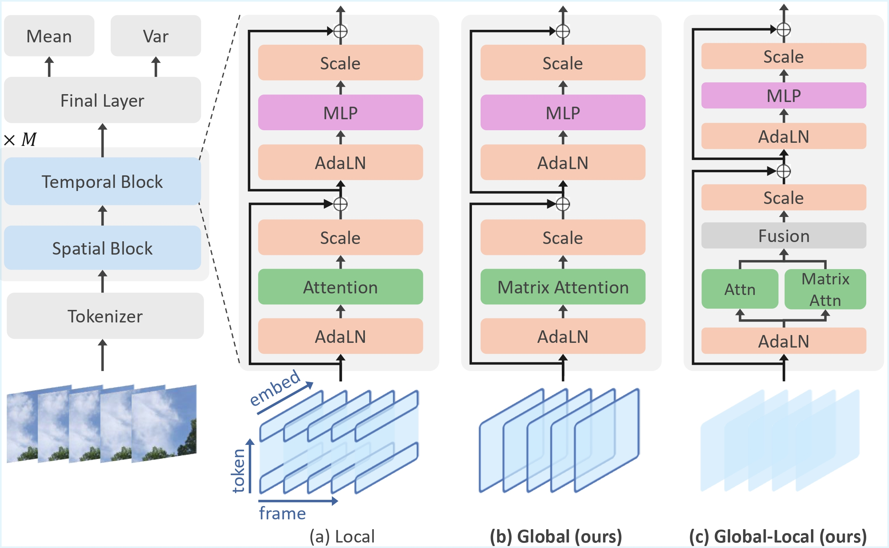

# FrameDiT: Diffusion Transformer with Frame-Level Matrix Attention for Efficient Video Generation

This is the official implementation for [FrameDiT: Diffusion Transformer with Frame-Level Matrix Attention for Efficient Video Generation](https://arxiv.org/abs/2603.09721) (CVPR Finding 2026)




## Setup
```commandline
cond env create -f environment.yml
conda activate FrameDiT
```

## Data preparation
Here are the links to download the datasets [FaceForensics](https://huggingface.co/datasets/maxin-cn/FaceForensics), [SkyTimelapse](https://huggingface.co/datasets/maxin-cn/SkyTimelapse/tree/main), [UCF101](https://www.crcv.ucf.edu/data/UCF101/UCF101.rar), and [Taichi-HD](https://huggingface.co/datasets/maxin-cn/Taichi-HD), [Pexels-400k](https://huggingface.co/datasets/jovianzm/Pexels-400k)


```
hf download maxin-cn/SkyTimelapse --repo-type dataset --local-dir <path_to_local_dir>
```

Then, change the data_path field in config files to the dataset path

## Training

```
accelerate launch --num_processes <GPUS_PER_NODE> train.py --config <path_to_config>
```

For T2V
```
accelerate launch --num_processes $GPUS_PER_NODE train_t2v_accelerate.py --config configs/pexels/FrameDiTHT2V-XL-256-2-concat_train.yaml
```


## Sample

```
torchrun --nnodes=1 --nproc_per_node=1 sample.py --config <path_to_config> --ckpt <path_to_ckpt> --save_video_path <path_to_save_dir>
```

For T2V

```
srun python sample_t2v.py --config <path_to_config>
```

## Acknowledgement
Our code is implemented based on [Latte](https://github.com/Vchitect/Latte)

## Citation
```
@misc{le2026framedit,
      title={FrameDiT: Diffusion Transformer with Frame-Level Matrix Attention for Efficient Video Generation}, 
      author={Minh Khoa Le and Kien Do and Duc Thanh Nguyen and Truyen Tran},
      year={2026},
      eprint={2603.09721},
      archivePrefix={arXiv},
      primaryClass={cs.CV},
      url={https://arxiv.org/abs/2603.09721}, 
}
```
